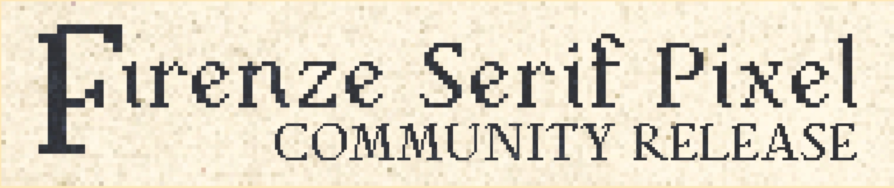

# Firenze Serif Pixel Community Release

**NOTE: THIS IS THE COMMUNITY RELEASE OF THE TYPEFACE “FIRENZE SERIF PIXEL.”**

**THE FULL VERSION OF THIS TYPEFACE IS STILL BEING DEVELOPED. IT WILL BE AVAILABLE AS A COMMERCIAL FONT AVAILABLE FOR PURCHASE.**

**THIS COMMUNITY VERSION OF FIRENZE SERIF PIXEL IS UNDER AN SIL VERSION 1.1 LICENSE. MORE AT THE END OF THIS FILE.**

------


[Click here to view the Simplified Chinese Version 点击这里来阅读简中版本](README_SC.md)

Firenze Serif Pixel is an elegant, humanist-like pixel serif typeface. It was inspired by the vibrant and irregular curves and shapes of humanist-style typefaces created during the Renaissance period in Italy, in contrast with the blackletter typefaces from the Middle Ages. The pixel looks give it a retro look inspired by video games in the 90s and early 00s. It would be ideal for you to use in your next graphical design or video game project.

## Technical details

This community release of Firenze Serif Pixel is available in TrueType and OpenType formats, available in TTF, OTF, WOFF, and WOFF2. It contains all the characters outlined in [Mac OS Roman](https://en.wikipedia.org/wiki/Mac_OS_Roman) (245 printable characters). 

Notice, this community release does not include any OpenType Features or alternate characters except for the standard `liga` feature.

Check the following image for all the characters this community release supports:


## Build from Source

You can either build the fonts using the Glyphs app (or other font editing programs) directly, or you can choose to build them in the command line using the Google Font Tools (`gftools`). You have to install Python 3.7 or later to use `gftools`.

1. Install `gftools` by executing the following command:
   
   ```
   $ pip install gftools
   ```

2. Navigate to `./.github/workflows/` in the command line.

3. Execute the following command:
   
   ```
   gftools builder config.yaml
   ```

4. Find the compiled fonts in the `.github/fonts` folder.

### Notes for non-Glyphs users

It is strongly recommended to use original Glyphs files whenever possible for preserving all metadata of this font.

But if that is not possible for you, you can also use the exported UFO (unified font object) files as an alternative choice. However, all the user-friendly glyph names are converted to production names (`uni####`).

## License

Firenze Serif Pixel Community Release is under a [SIL Open Font License, Version 1.1](https://github.com/26F-Studio/26F-Sans/blob/main/OFL.txt). You can use, modify, and redistribute the compiled fonts and the source files free of charge and you do not need to attribute to C29H25N3O5 (But we would appreciate that if you do so). **Please note that only the community release version is under a SIL OFL license. The full version of this typeface (unfinished as of now) will be available as a commercial paid font with purchasable licenses.**

The other part of the source code in this repository is under an [MIT License](https://github.com/26F-Studio/26F-Sans/blob/main/MIT.txt). 

## Credits

* Type Design and Testing — C₂₉H₂₅N₃O₅
