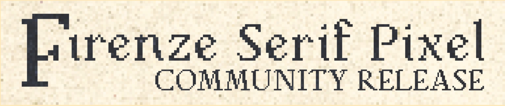
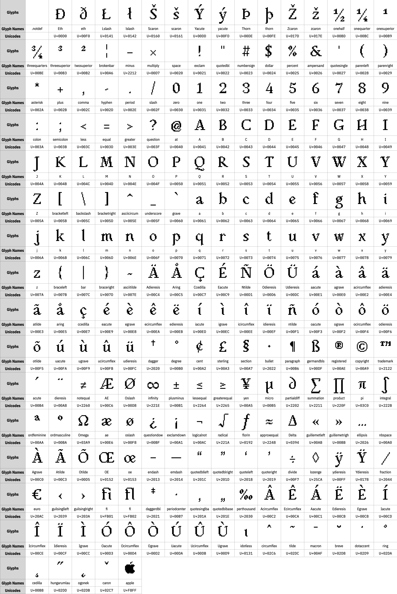

# Firenze Serif Pixel Community Release

**注意: 本仓库为 Firenze Serif Pixel 字体的社区发布版.**

**本字体的完整版本仍然在开发中. 该完整版本将会以商业字体的形式发布, 可供购买.**

**Firenze Serif Pixel Community Release (社区发布版) 使用 SIL 开源字体许可, 版本 1.1. 更多信息详见见本文件末尾.**

------

Firenze Serif Pixel是一种优雅、人性化的像素衬线字体。它的灵感来自文艺复兴时期意大利创造的充满活力和不规则的人文主义风格字体的曲线和形状，与中世纪的黑字字体形成鲜明对比。像素外观使其具有复古外观，灵感来自90年代和00年代初的电子游戏。它非常适合您在下一个平面设计或视频游戏项目中使用。

Firenze Serif Pixel 是一款优雅的 Humanist 风格的像素风衬线字体. 这款字体的设计灵感来自文艺复兴时期意大利流行的 Humanist 风格的手写字体充满活力的曲线和不规则的形状, 和中世纪时期的 Blackletter 字体形成鲜明对比. 点阵风格给予了这款字体复古的外观, 灵感来自 90 和 00 年代的像素风游戏界面. 这款字体很适合特定风格的平面设计和电子游戏.

## 技术细节

该社区版本的 Firenze Serif Pixel 以 TrueType 和 OpenType 版本提供, 以 TTF, OTF, WOFF, 和 WOFF2格式提供. 本字体包含 [Mac OS Roman](https://zh.wikipedia.org/wiki/Mac_OS_Roman) 字符集中的全部字符 (245 个可打印字符). 

请注意, 此社区版本不包含任何除标准连字 (`liga`) 以外的任何 OpenType 特性或其他备用字符.

下图展示了该社区版本支持的所有字符:



## 从源码构建

你可以使用Glyphs(或其他字体编辑软件)来直接构建本字体, 或使用命令行工具Google Font Tools (`gftools`). 你需要Python 3.7或之后的Python来使用`gftools`.

1. 执行以下代码来安装 `gftools` :
   
   ```
   $ pip install gftools
   ```

2. 在命令行界面中移动到 `./.github/workflows/`;

3. 执行以下命令:
   
   ```
   gftools builder config.yaml
   ```

4. 在 `.github/fonts` 目录中找到构建好的字体文件.

## 对于非Glyphs用户

***(施工中, 目前不可用)***

强烈建议尽可能使用原始Glyphs文件进行编辑和导出, 以保存该字体的所有元数据.

但是如果出于某些原因不能使用Glyphs文件的话, 你也可以使用导出的UFO(Unified Font Object)文件. 注意所有“用户友好”的字符形名称已被转换为产品名称(`uni####`).

## 许可

Firenze Serif Pixel Community Release使用 [SIL开源字体许可, V1.1](https://github.com/26F-Studio/26F-Sans/blob/main/OFL.txt). 你可以免费使用､ 修改和重新分发编译的字体和源文件, 而无需提及作者本人. **请注意, Firenze Serif Pixel 字体仅有社区发布版使用 SIL OFL许可. 该字体的完整版本 (目前尚未完成) 将作为商业付费字体提供.**

本仓库其他部分代码使用[MIT 协议](https://github.com/26F-Studio/26F-Sans/blob/main/MIT.txt).

# 作者

- 字体设计和测试: C₂₉H₂₅N₃O₅ 
